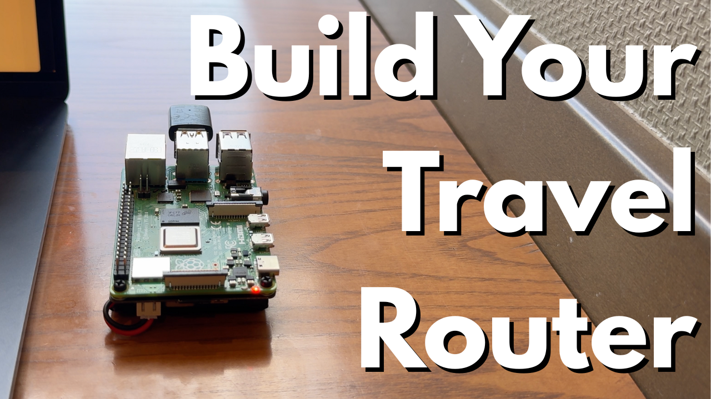

# Raspberry Pi 5 Travel Router

A complete guide to building a portable, secure travel router using Raspberry Pi 5, OpenWRT, and OpenVPN.

## Overview

This project creates a personal travel router that:
- Connects to public Wi-Fi networks (hotels, airports, cafes)
- Creates a private, secure Wi-Fi access point for your devices
- Routes all traffic through a VPN for privacy and security
- Runs on a mobile battery for portability

## Quick Start (Automated)

If you have Ansible installed, you can skip most of the manual steps:

1. Flash the SD card and set a password (Steps 1-2)
2. Edit `ansible/group_vars/openwrt.yml` with your WiFi and VPN credentials
3. Run `ansible-playbook -i ansible/inventories/hosts ansible/site.yml`

See [Step 10: Automated Setup with Ansible](./docs/10-ansible-automation.md) for the full walkthrough.

## Guide Structure

### Manual Setup

Follow these steps in order:

1. [Flashing OpenWRT](./docs/01-flashing-openwrt.md) - Download and flash the OS
2. [Initial SSH Setup](./docs/02-initial-ssh-setup.md) - First connection and password configuration
3. [Network Configuration](./docs/03-network-configuration.md) - IP address and interface setup
4. [Connecting to Wi-Fi](./docs/04-connecting-to-wifi.md) - Join an existing network
5. [USB Wi-Fi Adapter Setup](./docs/05-usb-wifi-adapter-setup.md) - Install drivers and packages
6. [Access Point Configuration](./docs/06-access-point-configuration.md) - Create your private network
7. [Auto-Start Script](./docs/07-auto-start-script.md) - Automatic startup on boot
8. [AWS OpenVPN Server Setup](./docs/08-aws-openvpn-setup.md) - Create VPN server on AWS
9. [OpenVPN Client Configuration](./docs/09-openvpn-client-config.md) - Connect router to VPN

### Automation

10. [Automated Setup with Ansible](./docs/10-ansible-automation.md) - Run steps 3-7 and 9 with a single command

## Hardware Requirements

| Component | Description |
|-----------|-------------|
| Raspberry Pi 5 | Main router hardware |
| MicroSD Card | For the OpenWRT operating system |
| SD Card Reader | To flash the OS from your laptop |
| USB Wi-Fi Adapter | Configured as an access point |
| Ethernet Cable | For initial setup connection |
| USB Type-C Cable | Power supply |
| Mobile Battery (Optional) | For portable power |

## Software Requirements

- OpenWRT (Operating System)
- Balena Etcher (Image flashing tool)
- Terminal/SSH Client
- AWS Account (for VPN server)
- Ansible (optional, for automated setup)
